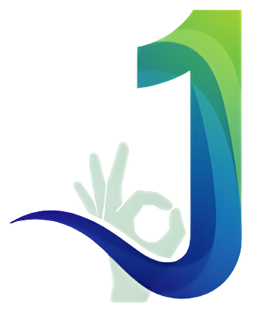
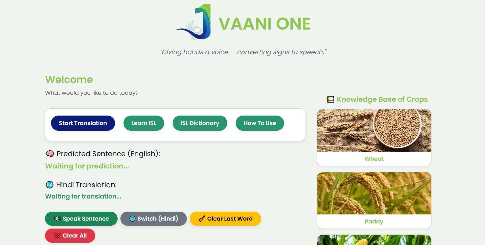

<!-- <div align="center">
	<code></code>
    </>
</div> -->

[](https://git.io/typing-svg)

<h1 style="text-align: center;">Sign Language to Speech Conversion System</h1>
<!-- # Sign Language to Speech Conversion System -->



---
A modular, end-to-end **Sign Language Recognition and Speech Generation system** that captures gestures via webcam, recognizes signs using deep learning, constructs meaningful sentences, translates them into Hindi, and optionally converts them to speech.

This repository is structured to clearly separate **data preparation**, **model training**, and **real-time deployment**, with **dedicated documentation files** (`.md`) for each script to ensure clarity, maintainability, and ease of understanding.

# 🌾 Use Case: Empowering KVK Educators

The primary motivation behind this project is to support differently-abled Krishi Vigyan Kendra (KVK) educators in effectively educating farmers. Many agricultural extension workers rely on verbal communication to teach farming practices, which can be challenging for educators with hearing or speech impairments.

This system bridges that gap by:

- Translating hand gestures into **meaningful instructions** in real time
- Providing **both English and Hindi text output** to match local language preferences
- Enabling speech synthesis, allowing farmers to hear instructions without relying on the educator’s voice

# 📁 Project Structure

```css
├── models/
│   ├── action5.h5
│   └── preprocess_params5.npz
│
├── pre-requisites/
│   ├── 01_record.py
│   ├── 01_record.md
│   ├── 02_extract_landmarks.py
│   ├── 02_extract_landmarks.md
│   ├── 03_train.py
│   └── 03_train.md
│
├── static/
│
├── templates/
│   ├── 2.html
│   └── howtouse.html
│
├── app.py
├── app.md
├── model_core.py
├── model_core.nd
│
├── README.md
└── requirements.txt
```

# 📘 Documentation Philosophy

- This `README` explains the overall system architecture, workflow, and folder-level purpose
- Each script has its own `.md` file that provides:
  - Line-by-line explanation
  - Function-level breakdown
  - Design decisions
  - Important assumptions and constraints
  
## 📌 Recommended Reading Order

1. This `README.md`
2. Script-level `.md` files (in numerical order)

# 🔍 High-Level System Overview

The project operates in **two distinct phases**:

1. **Offline Phase** – Dataset creation & model training
2. **Online Phase** – Real-time detection, translation, and speech via web interface

# Overall system architecture flow

```
Camera → MediaPipe → Landmark Extraction → LSTM Model → Sentence → Translation → Speech
```

# 🧩 Phase 1: Pre-Requisites (Offline Pipeline)

All scripts inside `pre-requisites/` are used to prepare the dataset and train the model.
Each script is accompanied by a detailed Markdown explanation file.

## 1️⃣ [01_record.py](pre-requisites/01_record.py) – Gesture Video Recording

### 📄 Detailed Documentation: [01_record.md](pre-requisites//01_record.md)

#### Purpose

- Records sign language gestures using a webcam
- Creates a structured dataset of short video sequences

#### Key Output

```
Recorded_Videos/
└── action_name/
    └── action_sequence.mp4
```

This script ensures:

- Fixed number of frames per gesture
- Consistent timing
- Clean action labeling

## 2️⃣ [02_extract_landmarks.py](pre-requisites/02_extract_landmarks.py) – Landmark Extraction

### 📄 Detailed Documentation: [02_extract_landmarks.md](pre-requisites/02_extract_landmarks.md)

#### Purpose

Converts recorded videos into numerical landmark data using MediaPipe

#### Landmarks Extracted

- Pose: 33 landmarks × 3 coordinates
- Hands: Up to 2 hands × 21 landmarks × 3 coordinates

#### Output Format

```
MP_Data/
└── action/
    └── sequence/
        └── frame.npy
```

This step transforms raw video into model-ready numerical sequences.

## 3️⃣ [03_train.py](pre-requisites/03_train.py) – Model Training

### 📄 Detailed Documentation: [03_train.md](pre-requisites/03_train.md)

#### Purpose

Trains an LSTM-based neural network on landmark sequences

#### Model Highlights

- Sequence-based learning (temporal context)
- Regularization for better generalization
- Automatic handling of missing frames

#### Outputs

| File                    | Description                  |
| ----------------------- | ---------------------------- |
| `action5.h5`             | Trained LSTM model           |
| `preprocess_params5.npz` | Mean & std for normalization |

# 🧠 Phase 2: Main System (Online Inference)
These scripts are used during **actual system execution**.

## 4️⃣ [model_core.py](model_core.py) – Real-Time Detection Engine

### 📄 Detailed Documentation: [model_core.md](model_core.md)

#### Purpose

Core logic for real-time sign recognition

#### Responsibilities

- Webcam capture
- MediaPipe landmark extraction
- Input normalization
- LSTM prediction
- Sentence construction
- Hindi translation
- Prediction confidence filtering

This module maintains global sentence state, enabling undo and clear operations.

## 5️⃣ [app.py](app.py) – Web & Speech Interface

### 📄 Detailed Documentation: [app.md](app.md)

#### Purpose

Flask-based interface for interacting with the system

#### Features

- Start detection
- View detected sentence
- View Hindi translation
- Clear last word / full sentence
- Text-to-speech output using gTTS

Detection runs in a background thread to keep the UI responsive.

# 🔄 End-to-End Workflow

```
┌────────────┐
│  Webcam    │
└─────┬──────┘
      ↓
┌────────────┐
│ MediaPipe  │
│ Landmarks  │
└─────┬──────┘
      ↓
┌────────────┐
│ Normalize  │
│ Input      │
└─────┬──────┘
      ↓
┌────────────┐
│ LSTM Model │
└─────┬──────┘
      ↓
┌────────────┐
│ Sentence   │
│ Builder    │
└─────┬──────┘
      ↓
┌────────────┐
│ Translation│
│ & Speech   │
└────────────┘
```

# ⚙️ Installation & Setup

```bash
pip install -r requirements.txt
```

### Requirements

- Python 3.8+
- Webcam
- Internet connection (for translation & TTS)

# ▶️ Running the System

```bash
cd main
python app.py
```

# ✨ Project Highlights

1. Clean, modular architecture
2. Script-level documentation with `.md `files
3. Real-time sequence-based gesture recognition
4. Translation + speech integration
5. Easily extensible for new signs and languages

# 🚀 Future Enhancements

1. Mobile (Android) deployment
2. Transformer-based gesture models
3. Offline translation & speech
4. Larger ISL vocabulary
5. Improved UI with live overlays

# 🧾 Conclusion

This project delivers a complete, modular sign language to speech conversion system, combining computer vision, deep learning, translation, and speech synthesis in a real-time pipeline.

It empowers KVK educators by converting hand gestures into sentences, translating them into Hindi, and producing audible instructions for farmers. The separation of data preparation, model training, and live inference, along with script-level documentation, ensures the system is maintainable, scalable, and easily extensible.

This repository provides a robust reference implementation for sequence-based gesture recognition systems and serves as a foundation for future expansion in vocabulary, languages, and deployment platforms.